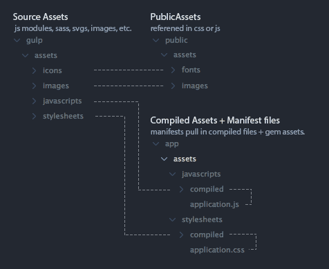

# The Gulp Asset Pipeline on Rails
- **Leaves Sprockets and manifest files intact** for use with gem installed assets
- Transform and bundle CommonJS modules (js or coffee) with Browserify
- Compile .sass/.scss with Libsass (node-sass through gulp-sass)
- Autoprefix css
- Optimize images (could be expanded to further proccess or resize images)
- Compile an icon font + sass from a folder of SVGs
- Full BrowserSync integration (the original Rails Asset Pipeline didn't work with live stylesheet injection)
- Revision filenames in production for caching
- Build assets on deploy with Heroku

[Production Environment Demo](https://gulp-rails-pipeline.herokuapp.com/) _(notice the revisioned asset filenames for caching)_

**This repo is only meant to be an example.** You should fork and customize it with your own Rails setup and relevant Gulp tasks, or copy the relevant files into an existing project. To understand more about individual modules, read the documentation on their respective websites and repositories. Based on [gulp-starter](https://github.com/greypants/gulp-starter).

## Running the Demo
Clone the repository
```
git clone https://github.com/greypants/gulp-rails-pipeline.git
```

Enter into the directory and run bundle install
```
cd gulp-rails-pipeline
bundle install
```

Install javascript dependencies. Once npm install runs, the `postinstall` setting in `package.json` will run `gulp build` and do an initial build of your assets.
```
npm install
```

Start the rails server.
```
rails s
```

Run gulp and rejoice! This will start watching and recompiling files on the fly, as well as open a with BrowserSync running.
````
gulp
```

Try editing `global.sass` and watch how fast it reloads the css! Once you taste the speed of Libsass + browers, you'll never go back. Test out changing view code and javascript as well.

## Asset File Structure

### gulp/assets
This is where all your source files will live. Your source icons for icon fonts, sass files, js modules, and images. Anything that needs to get processed by Gulp. All assets are set up to compile to `public/assets`.

### public/assets
The destination of your compiled and processed assets. The `application.css` and `application.js` manifest files in `app/assets` pull compiled code from this folder.

### app/assets
The old default asset directory should only include manifest files, which are necessary if you need to require gem installed assets (e.g., jquery_ujs, turbolinks) with Sprockets. The manifest files pull in gem assets, as well as our compiled js and css files from `/public/assets`.

## Rails setup notes:

### config/application.rb
```rb
# Make public assets requireable in manifest files
config.assets.paths << Rails.root.join("public", "assets", "stylesheets")
config.assets.paths << Rails.root.join("public", "assets", "javascripts")
```
If you plan on continuing to use Sprockets to `//require=` gem assets, you'll include your compiled js and css files in the `application.js` and `application.css` manifests files. The snippet above tells Sprockets to look in our `public/assets` directories when searching for required files. With this implementation, you'll continue using the Rails `javascript_include_tag` and `stylesheet_link_tag` asset pipeline helpers to pull in your manifest files (and everything they require). If you end up *not* needing the pipeline at all, you can pull in your compiled css and js directly with the `gulp_asset_path` helper (see below) and regular html.

### config/environments/development.rb
```rb
config.assets.debug = true
config.assets.digest = false
```
To fully take advantage of BrowserSync's live stylesheet injection, besure to configure the two values above. Setting `config.assets.debug` to `true` tells Rails to output each individual file required in you `application.js` and `application.css` manifests, rather than concatenating them. This is the default setting in development. Setting `config.assets.digest` to `false` disables appending md5 hashes for caching with future expire headers. With your individual files referenced and their file names unchanged, BrowserSync can reference and replace them properly as they get changed.

### package.json
```json
"scripts": {
  "postinstall": "gulp build"
},
"dependencies": {...}
```
After running `npm install`, Node will search the `scripts` object in `package.json` for `postinstall`, and will run the script if specified. `gulp build` compiles your assets. The build can be set up differently for different Rails environments. See below. A note about `dependencies`. Services like Heroku will ignore anything in `devDependences`, since it's techincally a production environment. So be sure to put anything your build process needs to run in `dependencies`, NOT `devDependencies.`

### gulp/tasks/build.js
```js
// line 6
if(process.env.RAILS_ENV === 'production') tasks.push('rev');
```
If the RAILS_ENV is set to `production`, assets will renamed with an appended md5 hash for caching with far future expire headers, and any refernces in stylesheets or javascript files will be updated accordingly. For inline asset references in Rails Views, you can use the following asset helper.

### app/helpers/application_helper.rb
```rb
def gulp_asset_path(path)
  path = REV_MANIFEST[path] if defined?(REV_MANIFEST)
  "/assets/#{path}"
end
```
Because we're storing our assets outside of the Rails Asset Pipeline, we need to re-implement the `asset_path` path helper (as `gulp_asset_path` to reference un-hashed files in `development`, and the cacheable hashed versions of the files in `production`. This goes for other Rails Asset Pipeline helpers, such as `<%= image_tag, 'asset.png' %>`. Instead, use `">`.

### config/initializers/rev_manifest.rb
```rb
rev_manifest_path = 'public/assets/rev-manifest.json'

if File.exist?(rev_manifest_path)
  REV_MANIFEST = JSON.parse(File.read(rev_manifest_path))
end
```

You'll notice this constant referenced in the `gulp_asset_path` helper above. The `gulp/tasks/rev.js` that gets run in production outputs a `rev-manifest.json` file, mapping the original filenames to the revisioned ones. If that file exists when the app starts, the hashed filenames are used. If it doesn't exist, the filename references rename unchanged.

## Deploying
To avoid git messyness and redundant rebases and merge conflicts, it's usually a good idea to `.gitignore` your compiled assets. This means you'll have to have them compile as part of your deploy process. In short, you'll need to ensure the following:

1. Node is installed
2. `npm install` runs
3. `gulp build` runs on `postinstall` (specified in package.json)

These steps must complete **before** starting the Rails server.

### Heroku
Heroku makes deploying SUPER easy, but there are a couple of things you'll need to do to get this running.

Since we're using Ruby (to run Rails) AND Node (to compile our assets with Gulp) in our setup, we need both running on our server. Heroku will automatically detect ONE of these at a time based on the presense of a `Gemfile` or `package.json`, but to get both running simultaneously, we need to [specifiy heroku-buildback-multi as your buildpack](https://github.com/ddollar/heroku-buildpack-multi). This enables us to specify multiple custom buildpacks in a `.buildpacks` file.
```
https://github.com/heroku/heroku-buildpack-nodejs.git
https://github.com/heroku/heroku-buildpack-ruby.git
```
Now, when we deploy to Heroku, first `npm install` will run, then our `postinstall` script specified in `package.json`, and then `bundle install` will run.

Take note of the following:
```rb
  #production.rb line 25
  config.serve_static_files = ENV['RAILS_SERVE_STATIC_FILES'].present?
```
Heroku requires `config.serve_static_files` to be enabled, so be sure to either add `RAILS_SERVE_STATIC_FILES` as a config var in your Heroku settings, or manually set this to true in your `production.rb` file.

### Capistrano

All we need to do is add a task to run `npm install` before we compile the assets.

The example below shows an example of using [nvm](https://github.com/creationix/nvm) (node version manager) to use the specified node version for your application.

```rb
# ./config/deploy.rb

before "deploy:assets:precompile", "deploy:npm_install"

namespace :deploy do
  desc "Run npm install"
  task :npm_install do
    invoke_command "bash -c '. /home/deploy/.nvm/nvm.sh && cd #{release_path} && npm install'"
  end
end
```

---
Original Blog Post: [viget.com/extend/gulp-rails-asset-pipeline](http://viget.com/extend/gulp-rails-asset-pipeline)
